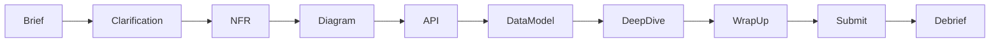

> **Archived (2026):** Interview/AI SD room was removed from prod. Kept for historical reference only. Live rooms today: code collab + Excalidraw whiteboard via `rooms` service.

# System Design Room

Quality-first mock interview workspace for `system_design` tasks: phased flow, Excalidraw diagram, AI interviewer chat, checkpoint critique, multi-pass final evaluation.

## Flow



| Phase | User work | AI (optional) |
|-------|-----------|---------------|
| brief | Read task brief | — |
| clarification | Q&A with interviewer | `RunSystemDesignInterviewerTurn` |
| nfr | Latency, throughput, consistency | checkpoint on request |
| diagram | Excalidraw canvas | `RunSystemDesignCheckpoint` (vision + critique) |
| api | REST/gRPC endpoints | interviewer follow-ups |
| data_model | Entities, indexes, sharding | checkpoint |
| deep_dive | Cache, replicas, fault tolerance | interviewer probes |
| wrap_up | Summary text | — |
| submitted | — | `RunEvaluation` → SD pipeline |

## Data model (interview DB)

### `system_design_workspaces`

One row per active `session_task` (`system_design` only).

| Column | Type | Notes |
|--------|------|-------|
| session_task_id | UUID PK | FK → session_tasks |
| user_id, session_id, task_id | UUID | denormalized for auth |
| phase | TEXT | snake_case phase id |
| functional_context, nfr, diagram, api_spec, data_model, infrastructure | JSONB | workspace blobs |
| wrap_up | TEXT | final summary |
| version | INT | optimistic concurrency |
| phase_started_at, updated_at | TIMESTAMPTZ | |

### `system_design_turns`

Chat / interviewer history.

| Column | Type |
|--------|------|
| id | UUID PK |
| session_task_id | UUID FK |
| phase | TEXT |
| role | `user` \| `interviewer` \| `system` |
| content | TEXT |
| metadata | JSONB |

## RPCs (interview-service)

HTTP prefix: `/v1/interview/session-tasks/{session_task_id}/system-design`

| RPC | Method | Purpose |
|-----|--------|---------|
| GetSystemDesignWorkspace | GET `.../workspace` | Load or create workspace |
| PatchSystemDesignWorkspace | PATCH `.../workspace` | Autosave fields + phase; `expected_version` |
| ListSystemDesignTurns | GET `.../turns` | Chat history |
| PostSystemDesignTurn | POST `.../turns` | User message → AI interviewer reply |
| RequestSystemDesignCheckpoint | POST `.../checkpoint` | Phase critique (diagram PNG optional) |
| SubmitSystemDesign | POST `.../submit` | Creates attempt + outbox |

Submit packs a JSON dossier into `attempts.answer_text` and stores diagram PNG reference in `attachments`.

## RPCs (ai-service, internal)

| RPC | llmchain task |
|-----|---------------|
| RunSystemDesignInterviewerTurn | `system_design_senior_mock` |
| RunSystemDesignCheckpoint | `sysdesign_critique` (+ optional `vision` on PNG) |
| RunEvaluation (existing) | SD branch: 3-pass dossier + diagram rubric |

## Content task metadata

```json
{
  "execution": "none",
  "room": "system_design",
  "functional_requirements": ["..."],
  "constraints": ["..."],
  "out_of_scope": ["..."],
  "clarification_answers": {"Q": "A"},
  "deep_dive_topics": ["caching", "sharding"],
  "reference_architecture_notes": "..."
}
```

## Billing (target)

- 1 SD session ≈ 1 `mock_interviews` entitlement (debited at session start)
- Interviewer turns + checkpoints: `sd_ai_turns_per_month` (Free 40, Pro 400)
- Final eval: 1 `ai_evaluations_per_day`
- Diagram PNG attached on submit → vision pass in final eval + checkpoint

## Frontend

- Route: `/interview/session/:sessionId/design` (redirect from SessionPage when `task.type === system_design`)
- Layout: phase nav, timer, Excalidraw, side panels (NFR/API/DB/infra), interviewer chat
- Autosave: debounced PATCH with version conflict handling

## Future: live human + voice

Deferred v3: WebRTC room (`rooms-service`), human interviewer role, STT/TTS for AI fallback. SD workspace schema is interviewer-agnostic (`role` column supports human).
